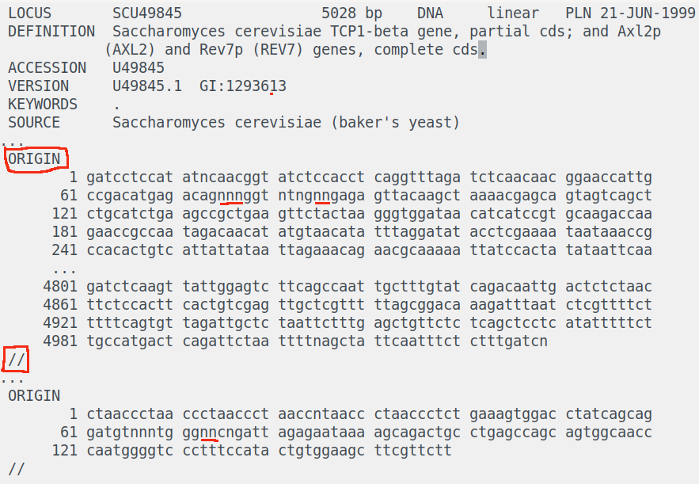

# CS 321 Bioinformatics Project

**Table of contents:**
- [Learning Objectives](#learning-objectives)
- [Starter Code](#starter-code)
- [Scrum Process](#scrum-process)
- [Project Requirements](#project-requirements)

<hr/>

# Learning Objectives

- Develop a complex project in a team by applying good software engineering practices such as  agile development, version control, and data persistence along with testing and code instrumentation.
- Demonstrate effective teamwork as a member or a leader of a team.
- Design, implement, and evaluate a computing-based solution to a given set of computing requirements for a problem from a specific domain.
- Learn how to implement a BTree external data structure on the disk.
- Demonstrate  how to use caching to improve performance of an application.
- Understand how bitwise operators reduce the memory footprint of data.
- Learn how to run an application in the cloud.

# Starter Code
This repository contains:
- the expected project package structure, in the [src/](src/) folder
- some partial implementation of classes, in the [src/main/java/cs321/](src/main/java/cs321/) folder
- sample [JUnit](https://junit.org/) tests, in the [src/test/java/cs321/](src/test/java/cs321/) folder
- sample input data and expected results, in the [data/](data/) folder
- a wrapper for the [gradle](https://gradle.org/) build tool, which simplifies installing and running gradle. In turn, gradle facilitates and handles:
    - Java library (e.g., JUnit) dependency management
    - Compiling the code
    - Generating self-containing jars
    - Running classes
    - Running unit tests

:heavy_exclamation_mark: **NOTE: Do NOT fork this repository**, because the forked repository
cannot have its own GitHub issues, which will be used as Scrum tasks.

:heavy_exclamation_mark: **NOTE: Do NOT modify the package structure in the [src/](src/) folder**,
otherwise the project may not be built correctly using gradle.

## Ensure that we have the correct JDK version
Use the following command to check our installed JDK version:
```bash
$ javac -version
```

This project **does not work** with JDK 20.

It is recommended to use either JDK 8, JDK 11 or JDK 17.

:book: See this [wiki page for additional details regarding the supported Java versions and links to download the correct JDK versions](https://github.com/BoiseState/CS321_Bioinformatics/wiki/Install-the-correct-JDK-version).


## One-Time Team Setup
One team member should:
- Create a new **private** GitHub repository and
    - Make sure to name the private repository as specified by your instructor
    - Give repository write permissions to all the other team members
    - Give repository read permissions to the instructor and the tutors or teaching assistants
	  (they will provide you with their GitHub ids)
- Clone (**not fork**) this repository and verify that gradle can be run.

```bash
$ git clone https://github.com/BoiseState/CS321_Bioinformatics.git
$ cd CS321_Bioinformatics
$ ./gradlew tasks
```

The last command should perform a one-time gradle setup, followed by
listing all the available gradle tasks and their descriptions.

**NOTE:** On Windows, the `./gradlew` command should be replaced with `gradlew`
(which will call the [`gradlew.bat`](/gradlew.bat) file)

The same team member should push the cloned repository to the new private repository.  This can
be done by changing the remote URL of the cloned repository to the new private repository's URL.

```bash
$ git remote set-url origin NEW_URL_OF_YOUR_NEW_PRIVATE_REPOSITORY
$ git remote -v
$ git push
```

The other team members should then clone the newly created student repository containing the
[starter code](#starter-code).

## Compile and Run the Project from the Command Line
Gradle allows running unit tests and code from IDEs, or the command line, as described below.

Run all the JUnit tests and print a summary of the results:
```bash
$ ./gradlew test
```

Run the `main` method from `GeneBankCreateBTree.java` and pass the [appropriate `<arguments>`](#51-program-arguments):
```bash
$ ./gradlew createJarGeneBankCreateBTree
$ java -jar build/libs/GeneBankCreateBTree.jar <arguments>
```

Run the `main` method from `GeneBankSearchBTree.java` and pass the [appropriate `<arguments>`](#51-program-arguments):
```bash
$ ./gradlew createJarGeneBankSearchBTree
$ java -jar build/libs/GeneBankSearchBTree.jar <arguments>
```


## Run the project from an IDE: IntelliJ IDEA, VSCode or Eclipse
### Eclipse
This repository is an [Eclipse](https://www.eclipse.org/) project, and can be directly opened in
[Eclipse](https://www.eclipse.org/).

:book: See this [wiki page for additional instructions to run this project in Eclipse](https://github.com/BoiseState/CS321_Bioinformatics/wiki/Instructions-to-run-in-Eclipse).

### IntelliJ IDEA
This project can be opened with [IntelliJ IDEA](https://www.jetbrains.com/idea/).

:bulb: HINT: As a student, you can get [IntelliJ IDEA](https://www.jetbrains.com/idea/) for free ([using an academic license](https://www.jetbrains.com/community/education/#students)) by signing up with your Boise State email.

:book: See this [wiki page for additional instructions to run this project in IntelliJ IDEA](https://github.com/BoiseState/CS321_Bioinformatics/wiki/Instructions-to-run-in-IntelliJ-IDEA).

### VSCode
Alternatively, this project can be opened with [VSCode](https://code.visualstudio.com/).

:book: See this [wiki page for detailed instructions to run this project in VSCode](https://github.com/BoiseState/CS321_Bioinformatics/wiki/Instructions-to-run-in-VSCode).

## Notes for creating additional files and tests, while keeping the Gradle project structure
We can add as many classes as we want in `src/main/java`, and gradle should build
them automatically. In other words, we should not have to make any changes to the `build.gradle`.

Also, we can add new test files with new tests cases in `src/test/java` and those will be run
automatically by gradle or our IDE.

<hr/>

# Scrum Process
The focus of this project is to learn about data structures, while working effectively in a group.
In addition, given the small project scope, and the fixed set of requirements that are already
defined (and will not need to be elicited with the use of a Product Owner), the team can
customize the Scrum process learned in CS-HU 271 and focus exclusively on:
- creating tasks
- linking commits to task IDs (e.g., `Implements task #123`)
- Test-Driven Development and unit testing. The [starter code](#starter-code) already contains a few [sample unit tests](src/test/java/cs321) that can be [run from the command line](#compile-and-run-the-project-from-the-command-line).

## Scrum Board
Creating the tasks upfront will allow dividing and assigning the work in order to provide
transparency and accountability within the team.

Use the [Projects](https://github.com/BoiseState/CS321_Bioinformatics/projects) tab (i.e., a simplified version
of [ZenHub](https://www.zenhub.com)) to configure our own team Scrum board,
based on this [project example](https://github.com/BoiseState/CS321_Bioinformatics/projects/1)
(feel free to copy the contents of these tasks to your Scrum board).

Your Scrum board should contain the following columns (pipelines):

Column Name     | Description
--------------- | -----------
Product Backlog | All (unassigned) tasks that are going to be completed by the team throughout the duration of the project
Sprint Backlog  | Tasks proposed to be implemented in the current week (sprint), assigned to developers
In Progress     | Tasks currently being worked on
Review/QA       | Tasks ready to be reviewed by another team member
Closed          | Completed tasks, whose corresponding code is integrated in the `master` branch

Tasks should be assigned to the developer working on them. Each team
member should add to the project log file, Project-Log.md, the tasks (e.g.,
`https://github.com/StudentUserNameHostingRepo/CS321_Bioinformatics/issues/123`) completed that
week, as described in the [progress reports](#9-progress-reports).

Here is an example of a [valid task](https://github.com/BoiseState/CS321_Bioinformatics/issues/3)
written in engineering language that is assigned to a developer. This task should be referenced
by a commit containing a message similar to `Implements task #3`.

As a warm up exercise, each team member should create a task similar to [`task
#2`](https://github.com/BoiseState/CS321_Bioinformatics/issues/2) and then edit the
[`README-submission.md`](/README-submission.md) file with their information.

Here is a sample project log from a team from a previous semester:
[Project-Log-sample.md](https://github.com/BoiseState/CS321_Bioinformatics/blob/master/Project-log-sample.md)

<hr/>

# Project Requirements


**Table of contents:**
- [Introduction](#1-introduction)
- [Background](#2-background)
- [Specifications](#3-specifications)
- [Design Issues](#4-design-issues)
- [Implementation](#5-implementation)
- [Using a Cache](#6-using-a-cache)
- [Using a Database](#7-using-a-database)
- [Useful Examples](#8-useful-examples)
- [Test Scripts](#9-test-scripts)
- [Testing in the Cloud](#10-testing-in-the-cloud)
- [Progress Reports](#11-progress-reports)
- [Submission](#12-submission)


<hr/>

## 1. Introduction
In this assignment, we will solve a problem from the field of Bioinformatics using BTrees.
The amount of data that we have to handle is large and any data structure is not likely to fit
in memory. Hence a BTree is a good choice for the data structure.

## 2. Background
_Bioinformatics_ is the field of science in which biology, computer science, and information
technology merge to form a single discipline. One of the primary aims of Bioinformatics is
to attempt to determine the structure and meaning of the human genome. The _human genome_
is a complete set of human DNA. The Human Genome project was started in 1990 by the United
States Department of Energy and the U.S. National Institutes of Health. By April 14, 2003 99%
of the Human Genome had been sequenced with 99.9% accuracy.  The Human Genome is a big strand
of 4 different organic chemicals, known as bases, which are:

- _Adenine_
- _Cytosine_
- _Thiamine_
- _Guanine_

Biologists often call them `A`, `C`, `T`, `G` for short. The bases `A` and `T` are always
paired together. Similarly the bases `C` and `G` are always paired together. So when we look
at the DNA representation, only one side is listed.  For example: the DNA sequence: `AATGC`
actually represents two sequences: `AATGC` and its complement `TTACG` (replace `A` by `T`,
`T` by `A`, `C` by `G` and `G` by `C`).  Even with only half the bases represented in a DNA
sequence, the human genome is about **2.87 billion characters** long!

See below an image of the DNA as well as the chemical structure of the bases.

 and Chemical (right) Structure of DNA")

The primary source for getting the human genome (as well as all other mapped organisms) is in the
National Center for Biotechnology Information (NCBI) website (http://www.ncbi.nlm.nih.gov/). See
this page for downloading [human genome data](https://www.ncbi.nlm.nih.gov/genome/guide/human/)

We will be using the GeneBank files from NCBI. The format is described with a sample file
at http://www.ncbi.nlm.nih.gov/Sitemap/samplerecord.html

Most of the information in a GeneBank file is of interest to biologists. We will only be
interested in the actual DNA sequences that are embedded in these files rather than in the
intervening annotations.

## 3. Specifications

### 3.1. Input Files
The GeneBank files have a bunch of annotations followed by the keyword `ORIGIN`. The DNA sequences
start from the next line. Each line has 60 characters (one of `A`, `T`, `C`, `G`, could be
lower/upper case) until the end of sequence, which is denoted by `//` on a line by itself.
Sometimes we will see the character `N`, which denotes that the sequence is not known at that
character. You would skip these characters as described below.

**When we reach a character `N`, we assume that the sequence has ended. Similarly, when we reach
`//`, we also assume that the sequence has ended. So at those points, we reset the sequence
that we were building and start over when we find the next valid character after seeing a `N`
or when we find the next `ORIGIN` tag.**

One GeneBank file may have several DNA sequences in it, each marked by `ORIGIN` and `//` tags.

Note that the GeneBank files typically have all bases and the `N` character in lowercase but they
could be in upper or lower case. For all our output, we will always have everything in lower case.

Here is a sample GeneBank file with the `ORIGIN` and `//` tags as well as some the `N` characters
highlighted.




Sample GeneBank files (having the `*.gbk` extension) can be found in the
[data/files_gbk/](data/files_gbk/) folder.

```bash
[amit@fedora-linux files_gbk(master)]$ ls -lh
total 2.8M
-rw-r--r--. 1 amit amit  11K Nov  1 07:55 test0.gbk
-rw-r--r--. 1 amit amit  11K Nov  1 07:55 test1.gbk
-rw-r--r--. 1 amit amit  21K Nov  1 07:55 test2.gbk
-rw-r--r--. 1 amit amit  21K Nov  1 07:55 test3.gbk
-rw-r--r--. 1 amit amit 4.1K Nov  1 07:55 test4.gbk
-rw-r--r--. 1 amit amit 2.7M Nov  1 07:55 test5.gbk
```
The files `test0.gbk` through `test4.gbk` are small files to help in debugging and testing our
code. The `test5.gbk` is a relatively large file that we can also use to test the performance
of our solution.

The [data/queries/](data/queries/) folder contains:
- sample query files
- a sample program named [`QueryGenerator.java`](data/queries/QueryGenerator.java) that generates
random queries for testing

An optional large test file is the Y chromosome for human beings. That is a large
file (31MB, but the smallest of all human chromosomes). To run our program on this
file is optional as it may take a long time! 10,000 nodes. Note that this file isn't
available on GitHub due to their limitation on file size. You can download it from here:
[hs_ref_chrY.gbk](https://drive.google.com/file/d/1zkAIQW8ol7HxGxNBeJTSuwES7EqPYiHx/view?usp=sharing)


### 3.2. Problem

The biological motivation for the problem is to study the frequency of different length
subsequences to see if they are random or that some subsequences are more likely to be found
in the DNA.

For a given GeneBank file, we want to *convert it into a BTree with each object being a DNA
subsequence of specified length `k` (where `1` ≤ `k` ≤ `31`)* We will take the DNA sequence
from the GeneBank file and break it into subsequences of length `k` each and insert them into
a BTree. Each subsequence will act as a key. We are interested in all subsequences with length
`k`. For example, in the sequence `AATTCG`, the subsequences of length three are: `AAT`, `ATT`,
`TTC` and `TCG`.

Once we have a BTree for a length `k`, we want to be able to *search for query subsequences of
length `k`*. The search returns the frequency of occurrence of the query string (which can be
zero if it is not found). 

We will also create a SQL database (for a specific length `k`) of subsequences and their
frequency to aid in searching. This can be created from the BTree.


## 4. Design Issues

### 4.1. Saving memory
We could represent each DNA base as a character. In Java, each character is stored in Unicode,
which requires 16 bits (or 2 bytes).  Since we only have four possible bases (`A`, `C`, `G`
and `T`), we can optimize on space by converting each DNA base to a 2 bit binary numbers. This
is because, a 2-bit binary number can represent four unique values, one for each DNA base. The
following table show the encoding we will use for the four bases (assuming lowercase for A, T,
C, G). We have included the Unicode values so we can see that it takes 8 times more space!

| DNA Base | 2-bit binary | Unicode (decimal) | 16-bit Unicode      |
| -------- | ------------ | --------------    | ------------------- |
| A        | 00           |  97               | 0000 0000 0110 0001 |
| T        | 11           | 116               | 0000 0000 0111 0100 |
| C        | 01           | 100               | 0000 0000 0110 0100 |
| G        | 10           | 103               | 0000 0000 0110 0111 |

Note that we have made the binary representations for complementary bases be binary complements
as well. For example, complement of the base `A` is `T` --- the complement of `00` is `11`.

With this compact representation, we can store a 31 length subsequence in a 64-bit `long`
primitive type in Java.


*Hint*: The reason why the upper limit of the sequence length is 31 but not 32 can be
explained as follows. The long type has 8 bytes or 64 bits to represent integers between
-9,223,372,036,854,775,808 and 9,223,372,036,854,775,807.  The first bit is been reserved for
the sign (+ or -) of the number and thus the effective number of bits for storing data is 63,
which can hold up to 31 2-bit binary codes (e.g., 00 for A, etc), using up 62 bits and then we
run out of space to add another 2-bit representation of a DNA base.

### 4.2. Key Values
Note that the binary compact representation of the subsequences will result in a unique 64-bit
integer value. Hence we can directly use that as our key value.

### 4.3. Class Design
We will need a `BTree` class as well as a `BTreeNode` class. The objects that we store in the
BTree will be similar to the objects we stored in the previous Hashtable assignment. You may
call the relevant class `TreeObject` to represent the objects.

## 5. Implementation
We will create three programs:
- one that **creates a BTree** from a given GeneBank file 
- second for **searching in the specified BTree** for subsequences of given length. The search program
assumes that the user specified the proper BTree to use depending upon the query length.
- third for **searching in the SQL database** for subsequences of specified length. This database
  would be created as a by-product of the first program.

The main Java classes should be named `GeneBankCreateBTree`, `GeneBankSearchBTree`, and
`GeneBankSearchDatabase`.

### 5.1. Program Arguments
The required arguments for the three programs are shown below:

```bash
java -jar build/libs/GeneBankCreateBTree.jar --cache=<0|1>  --degree=<btree-degree> 
	--gbkfile=<gbk-file> --length=<sequence-length> [--cachesize=<n>] [--debug=0|1]


java -jar build/libs/GeneBankSearchBTree.jar --cache=<0/1> --degree=<btree-degree> 
	--btreefile=<b-tree-file> --length=<sequence-length> --queryfile=<query-file> 
	[--cachesize=<n>] [--debug=0|1]

java -jar build/libs/GeneBankSearchDatabase.jar --database=<SQLite-database-path> 
      --queryfile=<query-file>
```

**Note that the arguments can be provided in any order.**

If the name of the GeneBank file is `xyz.gbk`, the subsequence length is <k> and the B-Tree degree
is <t>, then the name of the B-Tree file should be `xyz.gbk.btree.data.<k>.<t>`

- `<cache>` specifies whether the program should use cache (value `1`) or
no cache (value `0`); if the value is `1`, the `<cache-size>` has to be specified

- `<degree>` is the degree to be used for the B-Tree. If the user specifies `0`, then our
program should choose the optimum degree based on a disk block size of `4096` bytes and the
size of our B-Tree node on disk

- `<gbk-file>` is the input `*.gbk` file containing the input DNA sequences

- `<sequence-length>` is an integer that must be between `1` and `31` (inclusive)

- `<b-tree-file>` is the name of the B-Tree file generated by the `GeneBankCreateBTree` program

- `<query-file>` contains all the DNA strings of a specific subsequence length that we want
to search for in the specified B-Tree file. The strings are one per line and they all must
have the same length as the DNA subsequences in the B-Tree file. The DNA strings use `A`, `C`,
`T`, and `G` (either lower or upper case)

- `[<cache-size>]` is an integer between `100` and `10000` (inclusive) that represents the
maximum number of `BTreeNode` objects that can be stored in memory

- `<SQLite-database-path>` the path to the SQL database created after BTree creation for a
  specific sequence length. The name of the database file should be `xyz.k.db` where the sequence
  length is `<k>`, and the GeneBank file is `xyz.gbk`. The database file should have been
  created by the `GeneBankCreateBTree` program from the BTree it creates

- `[<debug-level>]` is an optional argument with a default value of zero

    - It must support at least the following values for `GeneBankSearchBTree`:

        - `0`: The output of the queries should be printed on the standard output stream. Any
        diagnostic messages, help and status messages must be be printed on the standard
        error stream

		- '1': The program displays more verbose messages. For example, it can show
		details of each search process

    - It must support at least the following values for `GeneBankCreateBTree`:

        - `0`: Any diagnostic messages, help and status messages must be be printed on standard
        error stream

        - `1`: The program writes a text file named `dump`, containing the frequency and the DNA
        string (corresponding to the key stored) in an inorder traversal, and has the following
        line format:

```bash
<DNA string> <frequency>
```

The following shows a segment of the dumpfile `test0.gbk.dump.5`. It has a total of 954 lines in it.
```bash
aaaaa 21
aaaac 16
aaaag 10
aaaat 18
aaaca 5
aaacc 5
aaacg 10
aaact 12
...
```

### 5.2. Additional Implementation Remarks

#### 5.2.1. Your programs should always keep the root node in the memory
Write the root node to disk file only at the end of the program and read it in when the program
starts up. In addition, our program can only hold a few nodes in memory. In other words,
we can only use a few BTreeNode variables (including the root) in our program (e.g., root,
parent, current, child, temporary node for split). However, if the cache is enabled, we can
store `<cache-size>` `BTreeNode` objects in the cache.

#### 5.2.2. Metadata storage
We need to store some metadata about the B-Tree on disk. For example, we can store the degree
of the tree, the byte offset of the root node (so we can find it), the number of nodes, and other
information. This information should be stored at the beginning of the B-Tree file. We read the
metadata when we open the B-Tree file and we write it back (as it may have changed) when we close
the B-Tree file at the end of the program.

#### 5.2.3. Layout of the B-Tree in the binary file 

The B-Tree is stored as a binary file on disk. This is the most efficient and compact way to
store the B-Tree data structure so it persists beyond the program. While it is possible to
store the B-Tree as a text file, it will lead to severe slowdown in the runtime.

The BTree data file will have an initial metadata section. The metadata section should contain
at least the byte offset of the root node. It may also optionally contain the degree of the
BTree and the number of nodes.  After the metadata, the rest of the file consists of BTreeNodes
laid out one after the other. A new node is added to the end of the file.

If the name of the GeneBank file is `xyz.gbk`, the subsequence length is `<k>` and the B-Tree
degree is `<t>`, then the name of the B-Tree file should be `xyz.gbk.btree.data`.`<k>.<t>`.

#### 5.2.4 Reading and Writing Nodes

- We will read/write one BTreeNode at a time. If the degree `<t>` is small, this would be
inefficient. To improve efficient, we should set the degree `<t>` to an **optimum** value such
that a BTreeNode fits one disk block (we are using 4096 bytes for the disk block size) as close
as possible with some empty padding space at the end (if needed).

- We will store the byte offset of a node on disk as the child pointers in the BTreeNodes. Note
that we never need real child pointers in memory.

- We will use RandomAccessFile  and FileChannel classes to read/write to the BTree
data file. This allows us to quickly set the file cursor to anywhere in the file
in O(1) time using the `position(long pos)` method. We will use the ByteBuffer
class to read/write to the BTree data file.  Please see the example of writing
to a random access binary data file shown in DiskReadWrite.java in the [Disk IO
example](https://github.com/BoiseState/CS321-resources/tree/master/examples/disk-IO-examples)
folder in CS321-resources repo. This example shows a complete binary search tree as an external
data structure in a binary file on disk.

#### 5.2.5 To query for a subsequence, we also query for its complement

Note that our BTree stores only one side of the DNA strand but there is a complementary strand
as well. This implies that when we search for a subsequence, we also need to search for its
complement to get the correct answer.

For example: the DNA sequence: `AATGC` actually represents two sequences: `AATGC` and its
complement `TTACG` (replace `A` by `T`, `T` by `A`, `C` by `G` and `G` by `C`). To search for
`AATGC`, we will search for both `AATGC` and its complement `TTACG` and then add the frequencies
to get the result.


## 6. Using a Cache
We will incorporate the generic Cache class from `Project 1` to improve the performance of
our B-Tree implementation. The size of the cache should be a command line argument. An entry
in the cache is a `BTreeNode`. With the cache enabled command line option, the `<cache-size>`
needs to be specified as well.

:book: Report the time improvement for sequences of length 20 on `test5.gbk` using a cache of size
`100`, `500`, `1000`, `5000`, and `10,000` in your [`README-submission.md`](/README-submission.md)
file.

For example, the table below shows the improvement the instructors got on their solution. Note that
your times will be different due to different hardware and differences in the implementation.

| gbk file | degree | sequence length | cache | cache size | cache hit rate | run time |
| -------- | ------ | --------------- | ----- | ---------- | -------------- | -------- |
| test5.gbk|  102   |     20          |  no   |    0       |      0%        |  29.52s  |
| test5.gbk|  102   |     20          |  yes  |    100     |      66.14%    |  12.56s  |
| test5.gbk|  102   |     20          |  yes  |    500     |      77.84%    |  10.22s  |
| test5.gbk|  102   |     20          |  yes  |    1000    |      81.45%    |  10.05s  |
| test5.gbk|  102   |     20          |  yes  |    5000    |      95.08%    |   5.08s  |
| test5.gbk|  102   |     20          |  yes  |    10000   |      99.51%    |   3.15s  |

Using a cache sped up the execution by a factor of 9.37! Using a cache will also speed up search in
larger BTrees. The `test5.gbk` BTree isn't large enough because a search only takes $\Theta(lg n)$
time!

We were able to create a B-Tree for the full human Y chromosome (`data/files_gbk/hs_ref_chrY.gbk`)
in about 14 minutes using a cache of size 10,000. With a cache of size 100,000 (about 400 MB
of memory), we were able to bring the time to create the BTree down to only 2m19s.

## 7. Using a Database 

Design a simple database to store the results (sequences and frequencies) from the B-Tree.
We will perform an inorder tree traversal to get the information to store in the database. This
would be done at the end of creating the GeneBank BTree. Then we will create a separate search
program named `GeneBankSearchDatabase` that uses the database instead of the BTree. This is
a common pattern in real life applications, where we may crunch lots of data using a data
structure and then store the results in a database for ease of access.

```bash
$ ./gradlew createJarGeneBankSearchDatabase
$ java -jar build/libs/GeneBankSearchDatabase.jar --database=<SQLite-database-path> 
      --queryfile=<query-file>
```

We will use the embedded SQLite database for this project.  The SQLite database is fully
contained in a jar file that gradle will automatically pull down for us. See the database
example in the section below on how to use SQLite.

## 8. Useful Examples

The following examples from the class examples repository will be useful for this project.

- [Disk IO example](https://github.com/BoiseState/CS321-resources/tree/master/examples/disk-IO-examples): In
  particular, look at DiskReadWrite.java. It shows the implementation of an external binary
  search tree on disk.
- [SQLite example](https://github.com/BoiseState/CS321-resources/tree/master/examples/SQLite): A
  quick starter example on how to set up and use SQLite.
- [Bitwise operators
example](https://github.com/BoiseState/CS321-resources/tree/master/examples/bitwise-operators-example):
In particular, look at SequenceUtils.java for helpful sequence utility code. A copy of this
has also been provided in the starter code for the project.

## 9. Test Scripts

Several test gbk files are provided in the folder: 
[data/files_gbk](https://github.com/BoiseState/CS321_Bioinformatics/tree/master/data/files_gbk).

An optional large test file is the Y chromosome for human beings. That is a large file (but
the smallest of all chromosomes!). To run our program on this file is optional as it may take
a long time!! For this test, we recommend a cache size of 10,000 nodes. Note that this file
isn't available on GitHub due to their limitation on file size. You can download it from here:
[hs_ref_chrY.gbk](https://drive.google.com/file/d/1zkAIQW8ol7HxGxNBeJTSuwES7EqPYiHx/view?usp=sharing)

If you want to compare your dumpfiles for the Y chromosome,
you can download our dump files from here: [hs_ref_chrY
dumpfiles](https://drive.google.com/drive/folders/1PcKafuaB3NkqQTWLVEYtDTscjwVbOxeR?usp=share_link).


Several pre-generated query files are provided in the folder: 
[data/queries](https://github.com/BoiseState/CS321_Bioinformatics/tree/master/data/queries).
To generate additional queries, we can use the `data/queries/QueryGenerator.java` program.

The expected dump files and query results are provided  for `test0.gbk` and `test5.gbk` in the folders:
[results/dumpfiles](https://github.com/BoiseState/CS321_Bioinformatics/tree/master/results/dumpfiles),
[results/query-results](https://github.com/BoiseState/CS321_Bioinformatics/tree/master/results/query-results)

In particular, results are provided for `query1`,..., `query10`, `query20`, and `query31` query files
for `test0.gbk` and `test5.gbk` GeneBank files.

Three test scripts are provided at the top-level of the project (for intergration testing). These
compare your results to the results files mentioed above.

```bash
./create-btrees.sh 
Usage:  create-btrees.sh  <datafile> 

./check-dumpfiles.sh 
Usage:  check-dumpfiles.sh  <datafile> 

./check-queries.sh 
Usage:  check-queries.sh  <datafile> 
```

Please note that the scripts require the name of the test file and then it will add the
appropriate path to the name to fnd it.  The `check-btrees.sh` script creates B-Trees for the given
data file for strings of length 1, 2, 3, 4, 5, 6, 7, 8, 9, 10, 20, 31. The `check-dumpfiles.sh`
compares the dump files from our code to the reference dump files. The `check-queries.sh`
script compares the results of queries to our program with the reference results.

The results are provided for test0.gbk and test5.gbk data files. You can use the test scripts
to run and compare results using the three test scripts as follows.

```bash
./gradlew createJarGeneBankCreateBTree
./gradlew createJarGeneBankSearchBTree

./create-btrees.sh test0.gbk
./check-dumpfiles.sh test0.gbk
./check-queries.sh test0.gbk
```

Then, repeat for `test5.gbk`.  The instructors will use these test scripts for the final testing of
your project.

Start off by running tests on your machine. If you do need to run them on `onyx` please only
run the smallest test (`test0.gbk`) to avoid overloading the `onyx` server.

## 10. Testing in the Cloud

We will setup [Amazon AWS](https://aws.amazon.com/) accounts for each student so that you can run
larger tests in the cloud. **Running our tests on AWS is required so we can all get experience
using the cloud.** :cloud: :smiley:

Please see the [AWS
notes](https://docs.google.com/document/d/1v5a0XlzaNyi63TXXKP4BQsPIdJt4Zkxn2lZofVP8qqw/edit?usp=sharing)
for a step by step guide on running your project on the AWS cloud. 

## 11. Progress Reports

Each team member will fill out a progress report (via a survey) each week. The link to the
survey will be  provided by the instructor.

In addition, each team member should log their project-related
activities for the week, including the URL to the tasks (e.g.,
`https://github.com/StudentUserNameHostingRepo/CS321_Bioinformatics/issues/123`) completed that
week, in a separate file named `Project-Log.md`.

Here is a sample log file:
[Project-log-sample.md](https://github.com/BoiseState/CS321_Bioinformatics/tree/master/Project-log-sample.md)

As a reminder, each commit should link (reference) in the commit message the completed task
(e.g., `Implements task #123`), in order to automatically link the task to the commit, and make
the code changes directly available from the task itself.

It is expected that each team should have at least one meeting every week.

Progress reports are confidential.

## 12. Submission
Before submission, make sure that you:
- make sure that your `README-submission.md` file is complete!
- can clone the team repository on the `onyx` server
- can [compile and run the program from the command line](#compile-and-run-the-project-from-the-command-line) on `onyx` and obtain the expected results (just try test0.gbk)
- run the [test scripts](#9-test-scripts)
- submit on onyx 

Make sure the [instructor and the teaching assistant(s) have access to the repository](#one-time-team-setup).
